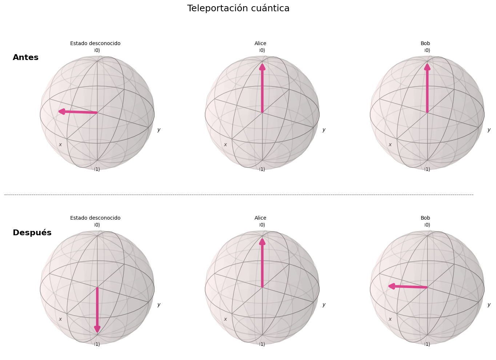
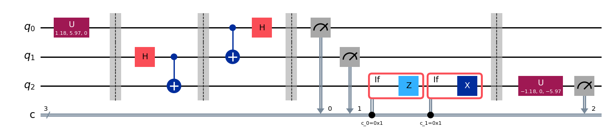

# Predicción de la Eficiencia en Teleportación Cuántica en Presencia de Ruido / Quantum Teleportation Efficiency Prediction Under Noise

Este repositorio contiene el código desarrollado para mi **Trabajo de Fin de Grado (TFG)** titulado *"Predicción de la Eficiencia en Teleportación Cuántica en Presencia de Ruido Mediante Aprendizaje Automático e Inteligencia Artificial Explicable"*, correspondiente al **Grado en Física** de la **Universidad Europea de Madrid**.

Este proyecto combina la **Computación Cuántica**, el **Aprendizaje Automático (Machine Learning)** y la **Inteligencia Artificial Explicable (XAI)** para modelar, predecir e interpretar el impacto del ruido cuántico real sobre la fidelidad en el protocolo de teleportación cuántica.

This repository contains the code developed for my **Undergraduate Thesis (TFG)** titled *"Predicción de la Eficiencia en Teleportación Cuántica en Presencia de Ruido Mediante Aprendizaje Automático e Inteligencia Artificial Explicable"*, for the **BSc in Physics** at **Universidad Europea de Madrid**.

This project combines **Quantum Computing**, **Machine Learning**, and **Explainable Artificial Intelligence (XAI)** to model, predict, and interpret the impact of real quantum noise on fidelity within the quantum teleportation protocol.

---

## ESPAÑOL

### ⚠️ Nota Importante de Ejecución
> **¡ADVERTENCIA!** No se recomienda ejecutar el notebook por completo. El código incluye conexiones y recolección de métricas de calibración de computadores cuánticos reales de IBM. Debido a que los niveles de ruido y las propiedades físicas de los chips cuánticos varían constantemente en el tiempo, volver a ejecutar las mediciones en vivo generará datos e intensidades de ruido distintas a las presentadas en el estudio original, alterando los resultados.

### 📋 Características del Proyecto
El proyecto simula el circuito clásico de teleportación cuántica (Alice y Bob) bajo diversos canales de error utilizando **Qiskit**, procesa los resultados mediante técnicas de Machine Learning y aplica interpretabilidad para entender la degradación de los estados cuánticos.

1. **Simulación Cuántica con Ruido:** Modelado de errores cuánticos reales (relajación térmica, amortiguamiento de amplitud - *amplitude damping*, errores unitarios coherentes y errores de lectura - *readout errors*).

   
2. **Aprendizaje No Supervisado (Clustering):** Segmentación y análisis exploratorio del comportamiento del ruido mediante algoritmos como *K-Means*, *Agglomerative Clustering* y *Mean Shift*.
3. **Modelos Predictivos (Supervisado):** Regresión de la fidelidad del estado teleportado
4. **Inteligencia Artificial Explicable (XAI):** Descifrado del modelo predictivo utilizando **SHAP** para cuantificar el impacto individual de cada tipo de error o compuerta sobre la pérdida de fidelidad.

### 🛠️ Tecnologías Utilizadas
* **Cuántica:** `qiskit`, `qiskit-aer`, `qiskit-ibm-runtime`, `pylatexenc`.
* **Machine Learning & Datos:** `scikit-learn`, `xgboost`, `pandas`, `numpy`.
* **Explicabilidad y Gráficos:** `shap`, `lime`, `matplotlib`, `seaborn`.

---

## ENGLISH

### ⚠️ Important Execution Note
> **WARNING!** It is not recommended to run the notebook in its entirety. The code includes connections and metrics collection from real IBM quantum computers. Because noise levels and quantum chip calibrations fluctuate constantly over time, re-running live measurements will generate different data and noise patterns than those analyzed in the original study, altering the final results.

### 📋 Project Overview
The project simulates the classic quantum teleportation circuit (Alice and Bob) under multiple error channels using **Qiskit**, processes the resulting dataset through Machine Learning pipelines, and leverages interpretability tools to inspect quantum state degradation.

1. **Noisy Quantum Simulation:** Modeling of realistic quantum errors (thermal relaxation, amplitude damping, coherent unitary errors, and readout errors).

2. **Unsupervised Learning (Clustering):** Profiling and exploratory analysis of quantum noise behaviors using *K-Means*, *Agglomerative Clustering*, and *Mean Shift*.
3. **Predictive Models (Supervised):** Regressing the fidelity of the teleported state
4. **Explainable AI (XAI):** Auditing the predictive models using **SHAP** to quantify how individual hardware parameters and gate errors impact final state fidelity.

### 🛠️ Tech Stack
* **Quantum:** `qiskit`, `qiskit-aer`, `qiskit-ibm-runtime`.
* **Machine Learning & Data:** `scikit-learn`, `xgboost`, `pandas`, `numpy`.
* **Explainability & Plotting:** `shap`, `matplotlib`, `seaborn`.

---
